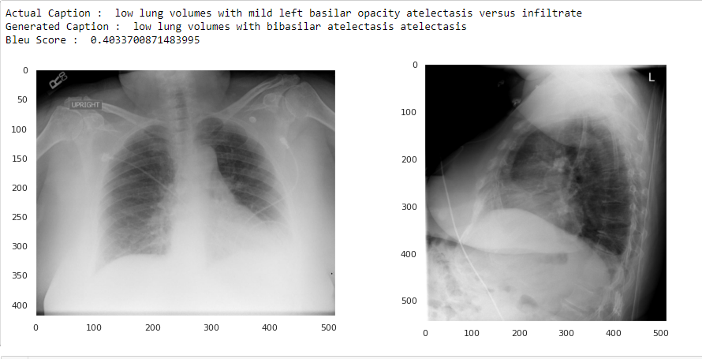

# msc-data-science-project-2021_22-piperalpha7
# **CHEST X-RAY KEYWORD GENERATION THROUGH DEEP LEARNING**
#### Deep Learning enthralled me, and I wanted to learn more about how meanings were derived from Images as well as Textual data. Having relatives who work in clinical fields, I was aware of how much stress clerical tasks add on top of clinical duties. As I read online, I came across a Dataset of Xrays. I thought that I should try my hand on a project which enables me to use this Dataset. Initially, my intention was to just generate keywords pertaining to an X-ray and its Report. But as, I moved forward, I took a step further to generate semantic captions of X-rays. The X-ray reports that we deal with have 4 main sections i.e. 'Comparison', 'Indications', 'Findings' and 'Impressions'. I have attempted to predict the 'Impression' section of the report, and is referred to as caption. For this project we have created 7 models(Model1,2,3,4,6,7,8)-Model5 not included
---
## Github Instructions
#### Following is a look at the files and folders in Github and what they mean 
- Model1 (Folder) - Contains Files pertaining to Model1
- Model2 (Folder) - Contains Files pertaining to Model2
- Model3 (Folder) - Contains Files pertaining to Model3
- Model4 (Folder) - Contains Files pertaining to Model4
- Model6 (Folder) - Contains Files pertaining to Model6
- Model7 (Folder) - Contains Files pertaining to Model7
- Model8 (Folder) - Contains Files pertaining to Model8
- Python Notebooks (Folder) - Contains the python notebooks for preprocessing as well as all the Models. Main file for all codes
- .gitattributes (File - gitfile) 
- CNN_DenseNet121diagram.png (File) -  Model Diagram of DenseNet121(CNN)
- X-ray1.xlsx - Intermediate excel file used to store DataFrame data in xml2df.ipynb
- X-ray2.xlsx - Intermediate excel file used to store DataFrame data in Preprocessing.ipynb
- X-raywithChex.pkl - Intermediate pickle file used to store DataFrame data in all Models '.ipynb' files
- X-raywithChex.xlsx -Intermediate pickle file used to store DataFrame data in all Models '.ipynb' files
- brucechou1983_CheXNet_Keras_0.3.0_weights.h5 - ChexNet weights used with DenseNet121(CNN)

--- 
#### Preview of one of the model folders. A look at the contents of the 'Model1' folder
Model1
- BleuMod1.pkl - Pickle file containing the Patient_ID,Predicted Caption(Impression),Generated Caption(Impression),BLEU score, also the final result file
- BleuMod1.xlsx - Excel file containing the Patient_ID,Predicted Caption(Impression),Generated Caption(Impression),BLEU score, also the final result file
- GreedyMod1.pkl - Intermediate Pickle file containing the Patient_ID,Predicted Caption(Impression) and Generated Caption(Impression) ONLY
- Losses1.txt - Text file containing the Training and Validation Loss Data.Created a seperate function to take this file as input and return a 'Loss vs Epoch' plot
- Model1.PNG - Schematic diagram for Model1
- Model1.h5 -Saved Model1
- Results_Model1 - Folder containing some results pertaining to the particular model. The files inside this folder are in '.png' format. For example

The structure of the folders Model2,Model3,Model4,Model6,Model7,Model8 is the same.

The files inside each model pertain only to that model and the files in them have the number of that particular model at the end.

For example Model2 has the file BleuMod2.pkl, Model3 has a file BleuMod3.pkl

---
#### Let us now have a look at 'Python Notebooks' folder . This is the folder which has the Python Code files for all the models:-
                        
- Model1.ipynb - Model1 Python Notebook
- Model2.ipynb - Model2 Python Notebook
- Model3.ipynb - Model3 Python Notebook
- Model4.ipynb - Model4 Python Notebook
- Model6.ipynb - Model6 Python Notebook
- Model7.ipynb - Model7 Python Notebook
- Model8.ipynb - Model8 Python Notebook
- Preprocessing.ipynb - 2nd preprocessing file
- xml2df.ipynb - 1st pre processing files

To clarify further, we have 2 preprocessing files . The first one is the 'xml2df.ipynb' and the second one is 'Preprocessing.ipynb'. These are common to all the Models

The sequence in which to go about the code for each model is as follows:-

- Model1 ----- xml2df.ipynb → Preprocessing.ipynb → Model1.ipynb
- Model2 ----- xml2df.ipynb → Preprocessing.ipynb → Model2.ipynb
- Model3 ----- xml2df.ipynb → Preprocessing.ipynb → Model3.ipynb
- Model4 ----- xml2df.ipynb → Preprocessing.ipynb → Model4.ipynb
- Model6 ----- xml2df.ipynb → Preprocessing.ipynb → Model6.ipynb
- Model7 ----- xml2df.ipynb → Preprocessing.ipynb → Model7.ipynb
- Model8 ----- xml2df.ipynb → Preprocessing.ipynb → Model8.ipynb

The X-Ray Image DataFiles, X-ray Report Files and the Glove Vector 200-d folders are massive and hence could not be added on Github. The references have been provided in the report for download of the same. The folders are on present on Google Drive and access will be shared with my project Supervisor  

